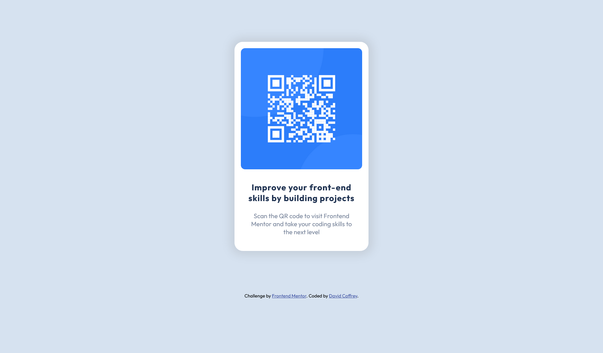

# Frontend Mentor - QR code component solution

This is a solution to the [QR code component challenge on Frontend Mentor](https://www.frontendmentor.io/challenges/qr-code-component-iux_sIO_H). Frontend Mentor challenges help you improve your coding skills by building realistic projects. 

## Table of contents

- [Overview](#overview)
  - [Screenshot](#screenshot)
  - [Links](#links)
- [My process](#my-process)
  - [Built with](#built-with)
  - [What I learned](#what-i-learned)
  - [Continued development](#continued-development)
  - [Useful resources](#useful-resources)
- [Author](#author)
- [Acknowledgments](#acknowledgments)

## Overview
This project/component was made using html5 and css3.

### Screenshot

### Links

- Solution URL: [Code on Github](https://github.com/DavidCaffrey/qr-code-component)
- Live Site URL: [Netlify App](https://qr-component-caffrey.netlify.app)

## My process
I layed out all the html elements first, whilst giving them all classes for styling purposes.Referring to the figma
files provided a good visual reference when it came to styling with css.

### Built with
- Semantic HTML5 markup
- CSS custom properties
- Mobile-first workflow

### What I learned

I initially styled all elements using px first and then went back and replaced these with rem's. This helped me
I think get the structure first. I learned the very basics of Figma.

### Continued development

To get a better understanding of figma and its capabilities, so as to make the development process easier. I need to create my own structured system for development i.e. a checklist of tasks

### Useful resources

- [MDN reference](https://developer.mozilla.org/en-US/) - This is always handy to have open on my desktop.

## Author

- Website - [David Caffrey](https://www.caffreymedia.com)
- Frontend Mentor - [@DavidCaffrey](https://www.frontendmentor.io/profile/DavidCaffrey)
- Twitter - [@DavidCaffrey18](https://www.twitter.com/DavidCaffrey18)

## Acknowledgments

I would like to acknowledge FrontEndMentor.io for providing such a 
